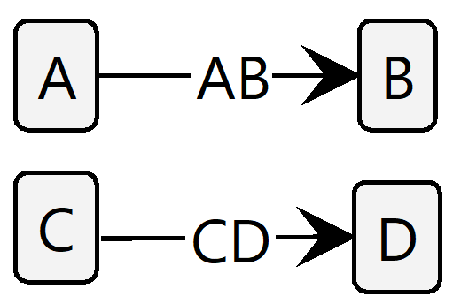
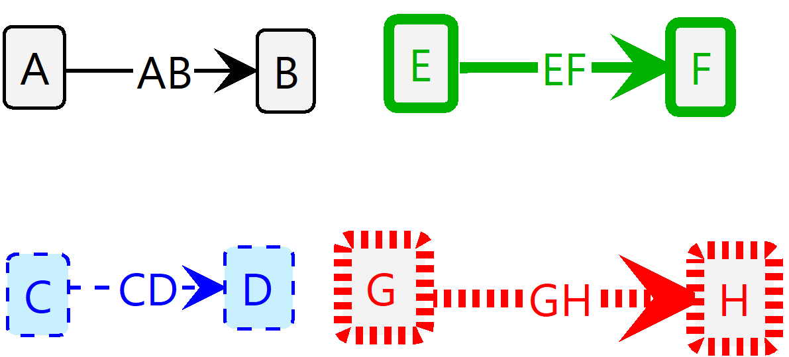
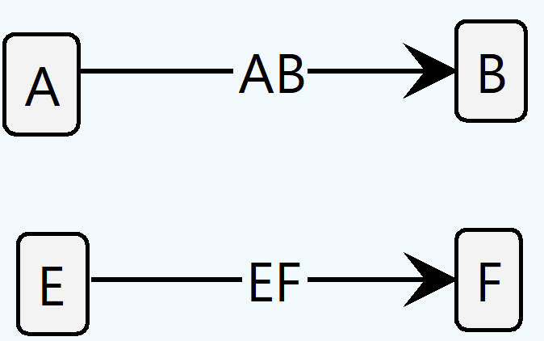

[](https://mvnrepository.com/artifact/io.github.timKraeuter/graph-rule-generation)
[](https://sonarcloud.io/summary/new_code?id=timKraeuter_graph-rule-generation)
[](https://sonarcloud.io/summary/new_code?id=timKraeuter_graph-rule-generation)
[](https://sonarcloud.io/summary/new_code?id=timKraeuter_graph-rule-generation)
[](https://sonarcloud.io/summary/new_code?id=timKraeuter_graph-rule-generation)

# graph-rule-generation

Available
on [Maven Central](https://mvnrepository.com/artifact/io.github.timKraeuter/graph-rule-generation)
and faster indexing
on [SonaType](https://central.sonatype.com/artifact/io.github.timKraeuter/graph-rule-generation).

# Usage

This library allows users to programmatically generate graphs, graph transformation rules, and even
_entire_ graph transformation systems. Currently, it targets the graph transformation
tool [Groove](https://groove.ewi.utwente.nl/).

## Generating graphs:

Graphs are created using the _GrooveGraphBuilder_ and can be written for Groove via the
_GrooveRuleAndGraphWriter_.
Here is an example of how to use the builder:

```java
GrooveGraphBuilder builder=new GrooveGraphBuilder();
    GrooveNode a=new GrooveNode("A");
    GrooveNode b=new GrooveNode("B");
    GrooveNode c=new GrooveNode("C");
    GrooveNode d=new GrooveNode("D");
    GrooveGraph graph=builder.name("Graph")
    .addEdge("AB",a,b) // Nodes are automatically added.
    .addEdge("CD",c,d)
    .build();
```

This results in the following Groove graph:



## Generating graph transformation rules:

Graphs are created using the _GrooveRuleBuilder_ and can be written for Groove via the
_GrooveRuleAndGraphWriter_.
Here is an example of how to use the builder:

```java
GrooveRuleBuilder ruleBuilder=new GrooveRuleBuilder();
    ruleBuilder.startRule("sampleRule");

// Context nodes and edges
    GrooveNode a=ruleBuilder.contextNode("A");
    GrooveNode b=ruleBuilder.contextNode("B");
    ruleBuilder.contextEdge("AB",a,b);
// Deleting nodes and edges
    GrooveNode c=ruleBuilder.deleteNode("C");
    GrooveNode d=ruleBuilder.deleteNode("D");
    ruleBuilder.deleteEdge("CD",c,d);
// Adding nodes and edges
    GrooveNode e=ruleBuilder.addNode("E");
    GrooveNode f=ruleBuilder.addNode("F");
    ruleBuilder.addEdge("EF",e,f);
// NAC nodes
    GrooveNode g=ruleBuilder.nacNode("G");
    GrooveNode h=ruleBuilder.nacNode("H");
    ruleBuilder.contextEdge("GH",g,h);

    GrooveGraphRule gtRule=ruleBuilder.buildRule();
```

This results in the following Groove graph transformation rule:



The rule can be applied to our graph generated above. The result is the following:



## Generating graph transformation systems:

```java

```

# Motivation

The tool is used in my PhD research
see [code](https://github.com/timKraeuter/Rewrite_Rule_Generation) or
my [website](https://timkraeuter.com/about/).
